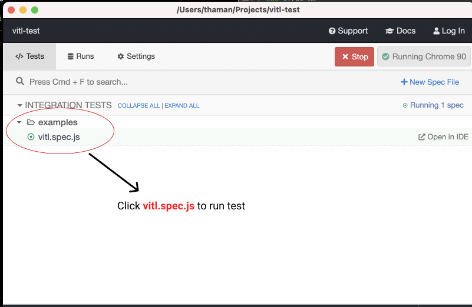

# Test project
This is a test project

# Running Your Site Locally
   
1. Install [Node.js and npm](https://nodejs.org/en/)

2. Clone project:

        git clone git@github.com:thamanchand/vitl-test.git
        cd vitl-test
         
3. Install npm dependencies:

        yarn

4. Starts a development server

        yarn start

5. Browse to [http://localhost:3000/](http://localhost:3000/)

# Running cypress test

Make sure development server is running at http://localhost:3000.

One new tab in terminal and start cypress server

1. Starts cypress test

        yarn run cypress open

4. CLick test

        
